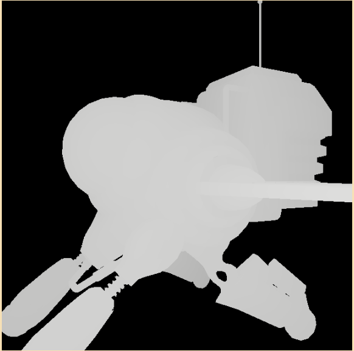

# A bvh implementation

A simple BVH(Bounding Volume Hierarchy) with sah(Surface Area Heuristic) implementation based on [Jacco Bikker's article](https://jacco.ompf2.com/2022/04/13/how-to-build-a-bvh-part-1-basics/)



```text
loaded 12582 triangles
build cost: 10.853ms
OpenGL: 4.6, GLFW: 3.4.0 Wayland X11 GLX Null EGL OSMesa monotonic
opengl debug message enabled
tracing time: 12.542ms (32.658268M rays/s)
tracing time: 18.244ms (22.449984M rays/s)
tracing time: 15.102ms (27.122234M rays/s)
tracing time: 10.949ms (37.40981M rays/s)
tracing time: 9.235ms (44.35301M rays/s)
tracing time: 15.663ms (26.1508M rays/s)
tracing time: 12.482ms (32.815254M rays/s)
tracing time: 13.839ms (29.597515M rays/s)
tracing time: 10.386ms (39.437706M rays/s)
tracing time: 15.662ms (26.152472M rays/s)
tracing time: 11.324ms (36.170963M rays/s)
tracing time: 17.429ms (23.50106M rays/s)
```

CPU:

```txt
Architecture:             x86_64
  CPU op-mode(s):         32-bit, 64-bit
  Address sizes:          39 bits physical, 48 bits virtual
  Byte Order:             Little Endian
CPU(s):                   24
  On-line CPU(s) list:    0-23
Vendor ID:                GenuineIntel
  Model name:             13th Gen Intel(R) Core(TM) i7-13700HX
    CPU family:           6
    Model:                191
    Thread(s) per core:   2
    Core(s) per socket:   16
    Socket(s):            1
    Stepping:             2
    CPU(s) scaling MHz:   24%
    CPU max MHz:          5000.0000
    CPU min MHz:          800.0000
    BogoMIPS:             4609.00
```